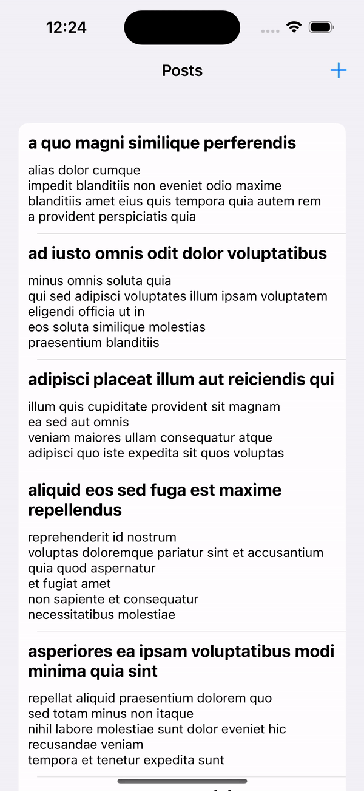
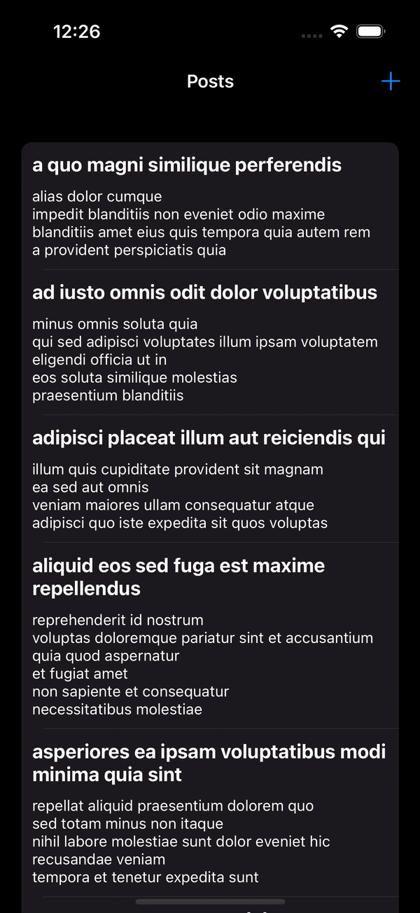

# iOS Post Management App

## Introduction

Hello! I'm Kostya, an iOS Engineer, and I'm excited to present my latest iOS application. 

## Demo

  
  

## Features

### Launch Screen
- Launch screen with application name and icon.

### Post List Screen

- **ViewController with TableView:** The primary screen displays a list of posts using `UITableViewDiffableDataSource` for seamless updates.
- **Callbacks:** Facilitates communication between the View and ViewModel through callbacks.
- **Data Fetching:** Upon screen load, the app uses URLSession to fetch data from a network, intelligently storing new posts into CoreData.
- **Post Deletion** Provide ability to delete posts from table view using swipe action and holding on post.
- **Responsive UI:** Fetched data is elegantly presented on the screen, ensuring a smooth and engaging user experience.

### Add User Screen

- **ViewController with TextField and TextView:** The second screen empowers users to add new posts through intuitive text fields for title and body.
- **Validation Rules:** Title and body fields must not be empty; the app disables add button if validation fails.
- **Go Back Action:** If there is unsaved data, an alert prompts user to confirm whether user wants to navigate back to the post list screen.
- **Duplicate Check:** The app checks for duplicate post titles, alerting users if a post with the same title already exists.

## Project Details

- **API link:** [https://jsonplaceholder.typicode.com/posts](https://jsonplaceholder.typicode.com/posts)
- **Technology Stack:**
  - **Design Pattern:** MVVM (Model-View-ViewModel), ensuring a structured and scalable codebase.
  - **UIKit:** Leveraging the power of UIKit for building a sleek and user-friendly interface.
  - **SnapKit:** Programmatically building UI for flexibility and maintainability.
  - **Target:** iOS 15.0+, embracing the latest iOS capabilities.
  - **URLSession:** Data fetching from the remote API.
  - **CoreData:** Managing local data storage for better user experiences.
  - **NSFetchedResultsController:** Provide the ability to listen on CoreData changes.
  - **Async/Await:** Asynchronous programming for responsive data handling.

## Getting Started

To run this app, make sure you have Xcode installed and set the deployment target to iOS 14.0 or later. Simply clone the repository, open the project in Xcode, and run the app on your iOS device or simulator.

